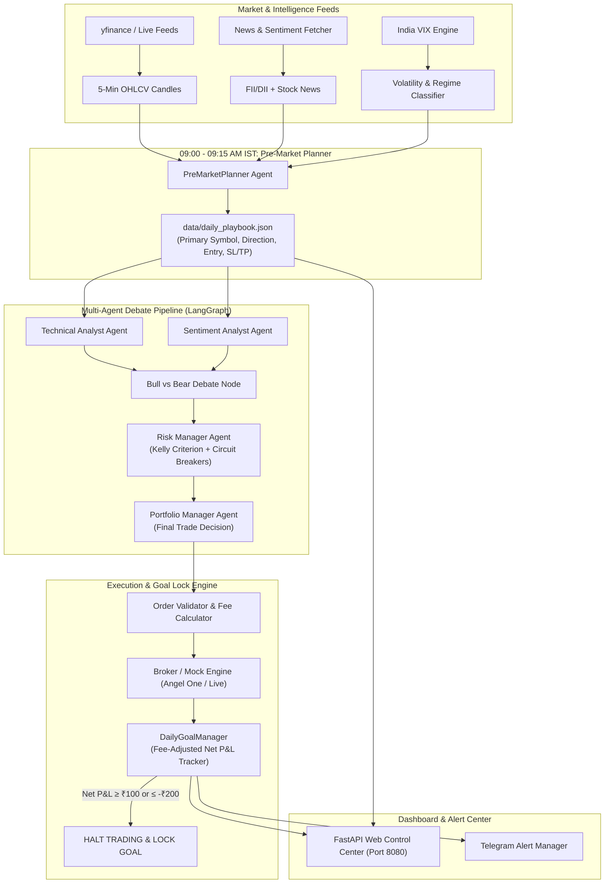
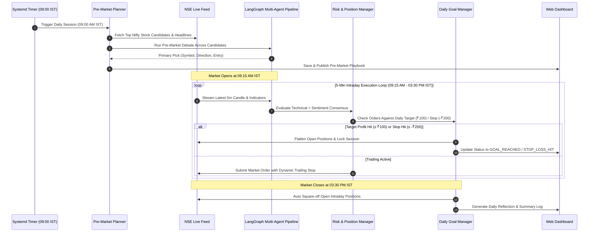
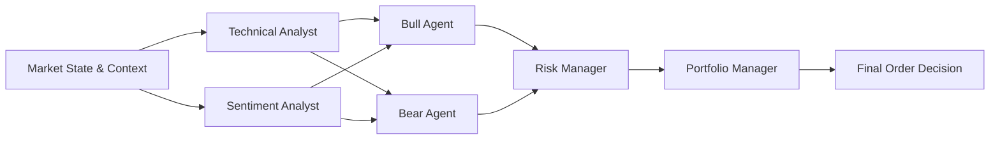
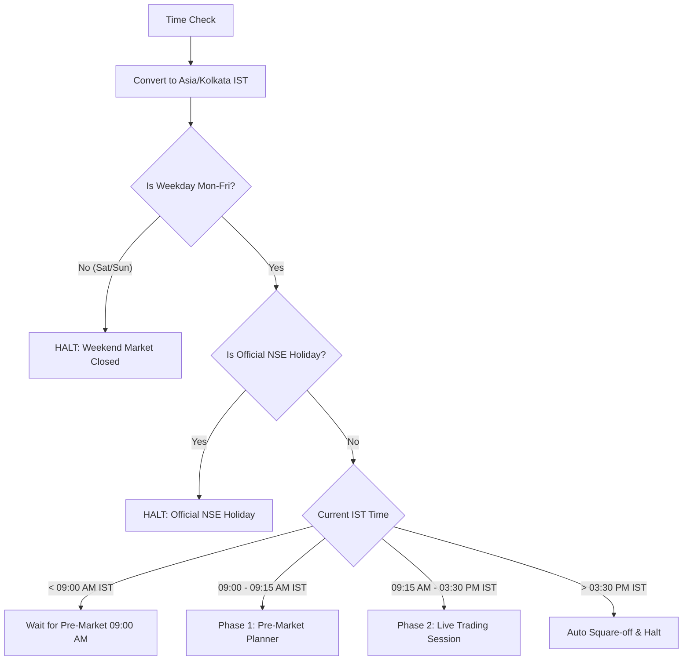
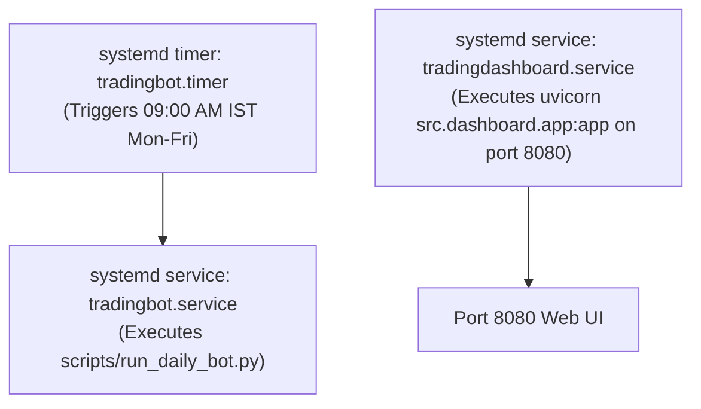

# Autonomous Agentic Trading Bot — System Architecture & Technical Specification

## 1. Executive Summary

The **Autonomous Agentic Trading Bot** is an end-to-end, self-improving algorithmic trading system engineered specifically for the Indian equity markets (NSE/BSE). Built around a **LangGraph-driven multi-agent LLM pipeline**, the bot automates the complete daily trading lifecycle: pre-market research, multi-agent debate, risk-vetted position sizing, real-time stop-loss monitoring, target profit locking, and post-market self-reflection.

### Core Objectives
1. **Target Profit Locking**: Achieve a daily net profit target (default: **₹100.00** fee-adjusted) or stop-loss limit (default: **-₹200.00**), immediately halting trading upon reaching either threshold to preserve capital.
2. **Autonomous Pre-Market Research**: Scan high-liquidity Nifty candidate stocks every morning between 09:00 AM – 09:15 AM IST to construct an AI-driven **Daily Playbook**.
3. **Multi-Agent Consensus**: Synthesize signals from six specialized agents (Technical, Sentiment, Bull, Bear, Risk Manager, Portfolio Manager) to eliminate single-model bias.
4. **Market & Timezone Protection**: Enforce strict IST timezone (`Asia/Kolkata`) rules, weekend filtering, and official NSE trading holiday calendars.
5. **Self-Learning Feedback Loop**: Persist trade reflections and calibrate agent consensus weights based on historical accuracy against actual price moves and fee friction.

---

## 2. High-Level Architecture Diagram

---

## 3. End-to-End Daily Session Lifecycle

---

## 4. Multi-Agent AI Debate Engine

The decision-making core is orchestrated using **LangGraph**, forming a multi-agent framework inspired by institutional trading desks:

### Agent Roles & Responsibilities

| Agent Role | Model Provider | Key Functions |
|---|---|---|
| **Technical Analyst** | Google Gemini (AGY CLI / Flash) | Calculates RSI, MACD, Moving Averages (EMA 9/21), ADX, and ATR support/resistance levels. |
| **Sentiment Analyst** | Google Gemini (AGY CLI / Flash) | Scrapes stock headlines, sector news, and FII/DII institutional cash flow movements. |
| **Bull Agent** | Google Gemini (AGY CLI / Pro) | Builds the best upside thesis, target prices, and growth triggers. |
| **Bear Agent** | Google Gemini (AGY CLI / Pro) | Identifies downside risks, overhead resistance, and failure patterns. |
| **Risk Manager** | Deterministic + Gemini Guard | Applies position sizing (Kelly Criterion), India VIX volatility adjustments, and circuit breakers. |
| **Portfolio Manager** | Google Gemini (AGY CLI / Pro) | Weighs agent arguments, verifies risk approval, and renders final `BUY`/`SELL`/`HOLD` decision. |

---

## 5. Risk Management & Profit Lock Architecture

### 5.1 Fee-Adjusted Net P&L Calculation
To guarantee that the target profit of **₹100.00** represents actual liquid profit, the `FeeCalculator` subtracts all statutory charges before recording trade outcomes:

$$\text{Net P\&L} = \text{Gross P\&L} - (\text{Brokerage} + \text{STT} + \text{Exchange Txn Fee} + \text{SEBI Fee} + \text{Stamp Duty} + \text{GST})$$

- **Brokerage**: ₹20 per executed order (or 0.03% whichever is lower for intraday equity).
- **STT (Securities Transaction Tax)**: 0.025% on sell side.
- **GST**: 18% on (Brokerage + Exchange Txn Charges).

### 5.2 Daily Target & Circuit Breakers
- **Target Profit Lock**: `₹100.00`. Once reached, `DailyGoalManager` transitions state to `GOAL_REACHED`, cancels pending orders, flattens open positions, and halts further order placement until the next trading session.
- **Daily Stop Loss**: `-₹200.00`. Halts session on `STOP_LOSS_HIT` to prevent severe drawdown.
- **Consecutive Loss Circuit Breaker**: Halts trading for the day if 3 consecutive losing trades occur.

---

## 6. Timezone, Schedule & Holiday Guard (`src/core/market_hours.py`)

The system implements strict market timing enforcement:

### Official NSE Holidays Handled
Integrated 2026 official holiday calendar including Republic Day, Holi, Ramzan Id, Good Friday, Independence Day, Gandhi Jayanti, Diwali, Christmas, etc.

---

## 7. Self-Learning & Accuracy Calibration (`src/agents/self_learning.py`)

The system records every decision and evaluates actual price movement against agent recommendations:

1. **Trade Reflection Memory**: Stores successful and failed trade reflections in markdown memory (`data/reflections.md`).
2. **Agent Accuracy Calibration**: Adjusts agent weights based on historical prediction accuracy after factoring in the 0.3% fee friction buffer.
3. **Prompt Enrichment**: Automatically injects past cross-ticker lessons into the Bull/Bear debate prompts to prevent repeating trading mistakes.

---

## 8. Web Control Center Dashboard (`src/dashboard/app.py`)

The bot features a real-time web dashboard built with **FastAPI** and **Vanilla CSS/JS**:

- **URL**: `http://rick.drunkcoder.dev:8080`
- **Widgets**:
  - 🎯 **Daily Profit Goal Progress Bar**: Live progress bar (`₹0.00 / ₹100.00`) and session status.
  - 🌅 **Pre-Market Playbook Card**: Morning stock pick, action signal, entry level, stop-loss, and take-profit targets.
  - ⚡ **Emergency Kill Switch**: One-click button to flatten all open positions and halt the bot immediately.
  - 📊 **Metrics Grid**: Equity, cash, realized P&L, unrealized P&L, drawdown.
  - 📜 **Live Log Console**: Real-time streaming logs from the execution loop.

---

## 9. Production Deployment Architecture (`rick.drunkcoder.dev`)

Deployed on Ubuntu Linux VM using **Systemd** for daemonized process management:

### Systemd Services

1. **`tradingbot.timer`**:
   - Schedule: `Mon..Fri *-*-* 03:30:00 UTC` (09:00 AM IST).
2. **`tradingbot.service`**:
   - Executes `scripts/run_daily_bot.py` in virtual environment.
3. **`tradingdashboard.service`**:
   - Executes `uvicorn src.dashboard.app:app --host 0.0.0.0 --port 8080` with auto-restart enabled.

---

## 10. Summary Table of Files & Components

| Component | File Path | Primary Function |
|---|---|---|
| **Daily Bot Runner** | `scripts/run_daily_bot.py` | Primary master script combining pre-market planning, trading loop, and goal locking. |
| **Market Hours Utility** | `src/core/market_hours.py` | Manages IST timezone, weekend filtering, and official NSE holiday validation. |
| **Daily Goal Manager** | `src/core/daily_goal_manager.py` | Tracks net P&L progress toward ₹100 profit target / ₹200 stop loss. |
| **Pre-Market Planner** | `src/agents/pre_market_planner.py` | Scans Nifty candidates at 09:00 AM IST to generate daily playbook. |
| **Agent Orchestrator** | `src/agents/orchestrator.py` | LangGraph multi-agent debate workflow coordinator. |
| **Self-Learning Engine** | `src/agents/self_learning.py` | Calibrates agent weights and records trade reflection memory. |
| **Web Dashboard** | `src/dashboard/app.py` | FastAPI web control panel running at port 8080. |
| **Deployment Script** | `scripts/deploy_rick.sh` | One-command build and restart script for `rick.drunkcoder.dev`. |
